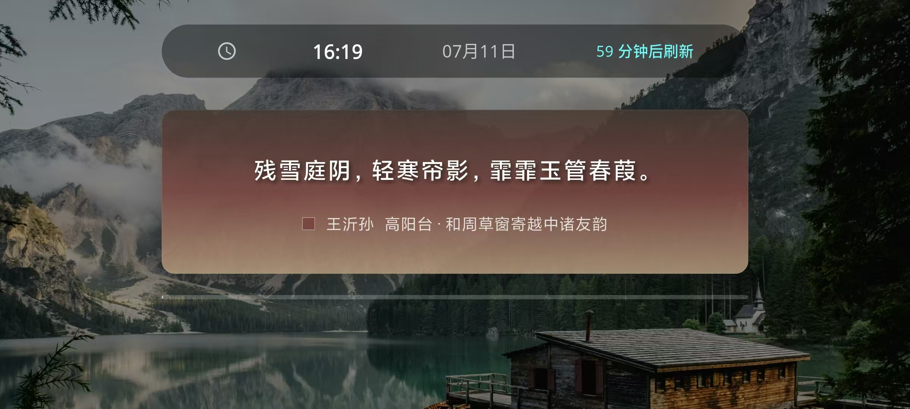
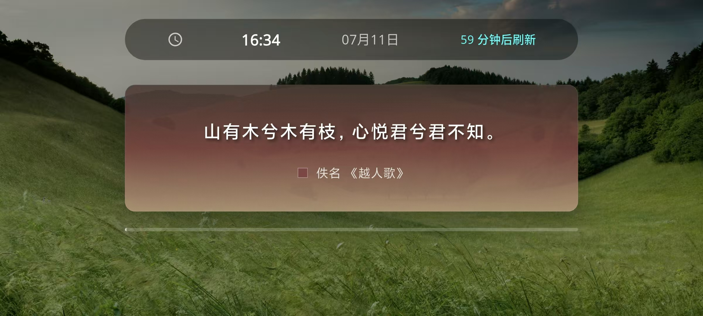
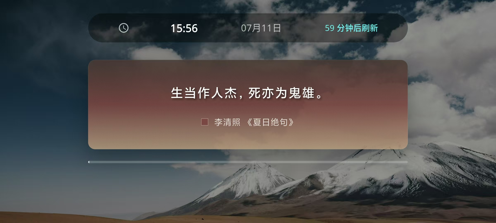

# 羲和 

<div align="center" width="300">


**一款优雅的桌面诗词摆件应用**

[](https://flutter.dev)
[](https://dart.dev)
[](LICENSE)
[]()

*让古典诗词点缀你的数字生活*

安卓下载地址：https://www.pgyer.com/xihe

苹果下载地址：直接在App Store 中搜索“羲和”。


</div>

---

## 📖 关于羲和

**羲和**是一款精致的诗词展示应用，旨在将中国古典诗词的韵味融入现代数字生活。

### ✨ 核心特性

- 🎨 **精美背景** - 10+ 精选背景图片，每次刷新随机切换
- 📚 **海量诗词** - 联网获取诗词API，离线也有精选诗词库
- ⏰ **自动更新** - 每小时自动刷新诗词，保持新鲜感
- 🌙 **横屏体验** - 专为横屏设计，完美适配桌面摆件场景
- 🔄 **手动刷新** - 随时点击刷新按钮，获取新的诗词
- 🌐 **双语支持** - 中英文界面，国际化体验
- 📱 **跨平台** - 支持 iOS 和 Android 双平台
- 🎯 **无广告** - 纯净体验，专注诗词之美
- 🔒 **零收集** - 不收集任何个人信息，完全尊重隐私

### 🎭 应用场景

- 📺 **办公桌摆件** - 放在显示器旁，工作间隙陶冶情操
- 🛏️ **床头屏保** - 横屏展示，睡前阅读诗词
- 🎓 **学习伴侣** - 潜移默化积累诗词知识
- 🎁 **文化礼物** - 送给喜爱传统文化的朋友

---

## 📱 下载安装

### iOS 安装

1. 前往 [App Store](https://apps.apple.com/app/xihe) 搜索"羲和"
2. 点击下载安装
3. 享受诗词之美

> 或从 [Releases](../../releases) 下载 `.ipa` 文件使用 Sideloadly 侧载安装

### Android 安装

1. 从 [Releases](../../releases) 下载最新的 `.apk` 文件
2. 在设备设置中允许"安装未知应用"
3. 直接安装 APK 文件

---

## 🖼️ 应用截图

<div align="center">

| 诗词展示 | 自动刷新 | 精美背景 |
|:---:|:---:|:---:|
|  |  |  |

</div>

---

## 🛠️ 技术栈

- **框架**: Flutter 3.32.5
- **语言**: Dart 3.8.1
- **状态管理**: Provider
- **网络请求**: http
- **本地存储**: shared_preferences
- **字体**: Google Fonts
- **动画**: flutter_staggered_animations

### 主要依赖

```yaml
dependencies:
  flutter:
    sdk: flutter
  provider: ^6.0.5          # 状态管理
  http: ^1.4.0              # 网络请求
  google_fonts: ^6.1.0      # 字体
  cached_network_image: ^3.3.1  # 图片缓存
  shimmer: ^3.0.0           # 加载动画
```

---

## 🚀 本地开发

### 环境要求

- Flutter SDK >= 3.8.1
- Dart SDK >= 3.8.1
- iOS 13.0+ / Android API 21+

### 快速开始

```bash
# 1. 克隆仓库
git clone https://github.com/zstar1003/Flutter_build_ios_test.git
cd Flutter_build_ios_test

# 2. 安装依赖
flutter pub get

# 3. 运行应用
flutter run

# 或指定设备
flutter run -d ios          # iOS 模拟器/设备
flutter run -d android      # Android 模拟器/设备
```

### 构建发布版本

```bash
# iOS
flutter build ios --release
flutter build ipa --release

# Android
flutter build apk --release
flutter build appbundle --release
```

---

## 📂 项目结构

```
lib/
├── main.dart                 # 应用入口
├── models/                   # 数据模型
│   └── quote.dart           # 诗词模型
├── providers/                # 状态管理
│   └── quote_provider.dart  # 诗词提供者
├── screens/                  # 页面
│   └── home_screen.dart     # 主页面
├── services/                 # 服务层
│   └── quote_service.dart   # 诗词服务
├── theme/                    # 主题配置
│   └── app_theme.dart       # 应用主题
└── widgets/                  # 自定义组件
    └── quote_display.dart   # 诗词显示组件
```

---

## 🎨 设计理念

羲和的设计遵循以下原则：

1. **简约至上** - 去除一切干扰，专注诗词内容
2. **沉浸体验** - 横屏全屏显示，隐藏系统栏
3. **视觉美感** - 精选背景图片，配合优雅字体
4. **交互自然** - 简单手势，符合直觉
5. **性能优先** - 流畅动画，快速响应

---

## 🌐 API 说明

羲和使用以下 API 获取诗词内容：

- **主要API**: [saintic 诗词接口](https://hub.saintic.com/openservice/sentence/)
- **备用方案**: 内置10+精选诗词

当网络不可用时，应用会自动切换到内置诗词库，确保离线体验。

---

## 🔒 隐私政策

羲和非常重视用户隐私：

- ✅ **不收集**任何个人信息
- ✅ **不追踪**用户行为
- ✅ **无广告**，无第三方跟踪
- ✅ **开源透明**，代码可审查

完整隐私政策: [https://zstar1003.github.io/Flutter_build_ios_test/](https://zstar1003.github.io/Flutter_build_ios_test/)

---

## 🤝 贡献指南

欢迎贡献代码、报告问题或提出建议！

### 如何贡献

1. Fork 本仓库
2. 创建特性分支 (`git checkout -b feature/AmazingFeature`)
3. 提交更改 (`git commit -m 'Add some AmazingFeature'`)
4. 推送到分支 (`git push origin feature/AmazingFeature`)
5. 开启 Pull Request

### 报告问题

如果您发现 bug 或有功能建议，请[创建 Issue](https://github.com/zstar1003/Flutter_build_ios_test/issues/new)。

---

## 📋 更新日志

### v1.0.0 (2025-01-04)

- 🎉 首次发布
- ✨ 诗词展示功能
- ⏰ 每小时自动刷新
- 🎨 10+ 精美背景
- 🌐 网络/离线双模式
- 📱 iOS/Android 双平台支持

---

## 📄 开源协议

本项目采用 [MIT License](LICENSE) 开源协议。

```
MIT License

Copyright (c) 2025 zstar1003

Permission is hereby granted, free of charge, to any person obtaining a copy
of this software and associated documentation files (the "Software"), to deal
in the Software without restriction, including without limitation the rights
to use, copy, modify, merge, publish, distribute, sublicense, and/or sell
copies of the Software, and to permit persons to whom the Software is
furnished to do so, subject to the following conditions:

The above copyright notice and this permission notice shall be included in all
copies or substantial portions of the Software.
```

---

## 👨‍💻 作者

**zstar**

- GitHub: [@zstar1003](https://github.com/zstar1003)
- Email: zstar1003@163.com

---

## 🙏 致谢

- [Flutter](https://flutter.dev) - 优秀的跨平台框架
- [saintic.com](https://hub.saintic.com) - 提供诗词API
- [Google Fonts](https://fonts.google.com) - 优质字体资源
- 所有为中国古典诗词传承做出贡献的人们